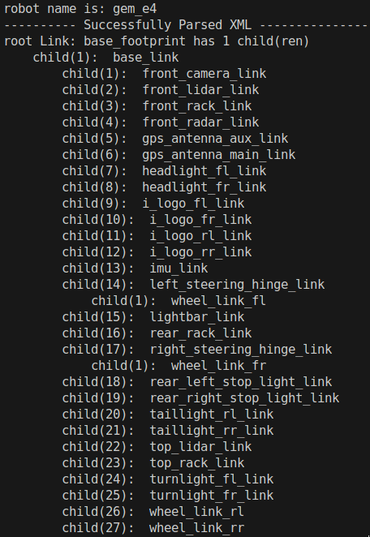

#

## on GEM e4 car

```bash
# cd to folder demo_ws

source devel/setup.bash 
roslaunch basic_launch sensor_init.launch 

source devel/setup.bash 
bash src/utility/radar_start.sh 

source devel/setup.bash 
roslaunch basic_launch visualization.launch 

source devel/setup.bash
roslaunch basic_launch dbw_joystick.launch
```

# GEM e4 car Documentation

[GEM e4 Vehicle](https://publish.illinois.edu/robotics-autonomy-resources/gem-e4/)

# make fusion a package

package.xml

CMakeLists.txt

catkin_make


# pedestrian

python3 visualize/webcam.py
python3 main.py --variant=detector_only launch/pedestrian_detection.yaml


# gather data

python3 main.py launch/gather_data.yaml 


# rosbag

roscore
rosbag play -l logs/<rosbag>/<vehicle.bag>


# tf
sudo apt install ros-noetic-tf2-tools
rosrun tf2_tools view_frames.py 
rosrun tf tf_monitor  # all tf


# Model


`sudo apt install liburdfdom-tools`

- ~/Projects/catkin_ws/src/fusion/urdf/gem_e4.urdf
- GEMstack/knowledge/vehicle/model/gem_e4.urdf

`check_urdf <urdf_file_path>`
1. 

`urdf_to_graphiz <urdf_file_path>`
1. generate .pdf .gv


use prefix in the URDF STL file path `package://fusion/`


# fusion with rviz

roslaunch fusion sensors.launch

[tf2_ros - ROS Wiki](http://wiki.ros.org/tf2_ros)

**static_transform_publisher** args
1. `static_transform_publisher x y z yaw pitch roll     frame_id child_frame_id` - **yaw(Z), pitch(Y), roll(X)**
2. `static_transform_publisher x y z qx  qy    qz   qw  frame_id child_frame_id` - **quaternion**


RViz 只是找到最接近的 TF 时间戳进行匹配

RViz 不会严格要求 TF 和传感器数据的 Hz 完全相同，它使用 最近邻插值（nearest neighbor interpolation） 或 时间回溯（time extrapolation） 来匹配 TF 和传感器数据


sudo apt install ros-noetic-pcl-ros ros-noetic-pcl-conversions
sudo apt install libpcl-dev
sudo apt install python3-pcl


# Sensors


[OAK-D LR - LongRange](https://www.oakchina.cn/product/oak-d-lr/)

Sensor Model: Triple AR0234 2.3MP
Shutter Type: Global
Three Stereo Baselines: 5cm, 10cm, and 15cm
Camera Spacing: {right} {middle} {left}
Resolution: 1280 x 800
Framerate: 23 FPS @ 1280 x 800
Speed: USB3.1 @ 5 Gbps


# ROS

[ROS Tutorials](https://wiki.ros.org/ROS/Tutorials)


