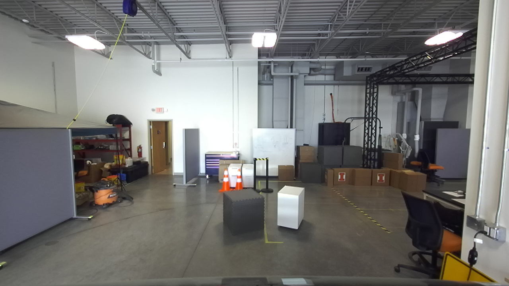
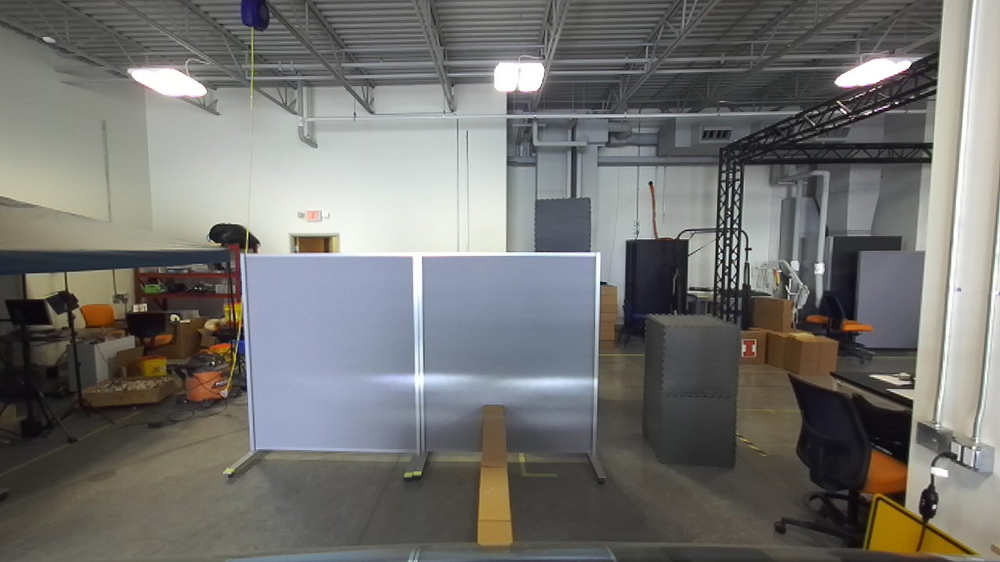

# Calibration
In this calibration, we get the intrinsic metric of the zed camera, the zed2lidar, lidar2vehicle, and zed2vehicle

## Step 1
We get the intrinsic parameters of the zed camera using the `get_zed_intrinsic.py` and save the intrinsic parameters into the json file `zed_intrinsic.json` under the `knowledge/calibration`

After getting the intrinsic parameters of the zed camera, we can project the depth from zed camera into its camera coordinate. In the meanwhile, we can get the point cloud from the lidar camera, we put some high blocks in front of the car to help with the alignment. Then we directly apply ICP to calculate zed2lidar. Below is the example image we captured. Our code is in `icp_alignment.py`

# Step 2
For this step, we want to calculate the transformation between the lidar camera and the vehicle. For the translation, we just manually measure all distances. For the rotation, we put a big white board in front of the car and parallel to the car y axis (we use some boxes between the car and the white board to make sure they are paralley in y axis). Then we capture the point cloud of the big plane using lidar, and fit a plane to the whilte board to calculate its normal. We convert the angle to the rotation matrix. Below is the example image we capture for this case. Our code is in `calibrate_lidar_to_axle.py`.

After getting the transformation between the lidar and the vehicle, we calculate all other transformations using the code `calculate_all_trans.py` and then we change the corresponding rotation and translation in `knowledge/gem_e2_zed.yaml` and `knowledge/gem_e2_velodyne.yaml`.