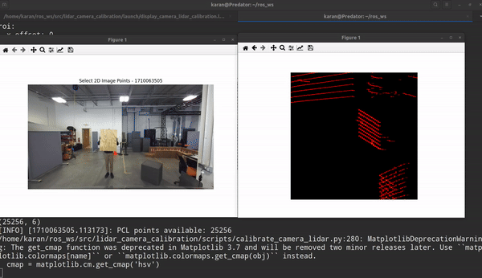

# Calibration
## Scripts
- `get_intrinsics.py`: Step 1 usage - get the intrinsic matrix of the camera using the file "zed_camera_info.pkl".
- `calibrate_camera_lidar`: Get extrinsic matrix (T_Velodyne_Zed) using a PnP based solver after selecting points between Lidar pcd and the image using a matplotlibGUI.    $ roslaunch lidar_camera_calibration display_camera_lidar_calibration.launch
- `get_transforms.py`: Get the transformation matrix (T_Zed_Vehicle) using (T_Velodyn_Zed and T_Velodyne_vehicle).


## STEP 1: LiDAR -> Camera Calibration
1) Record Rosbag for calibration by moving a board in the camera and Lidar frame of the vehicle at different orientations and positions.


2) The rosbag should contain all the following topics:
```
 /sensors/velodyne_points    (sensor_msgs/PointCloud2)
 /sensors/camera/image_color (sensor_msgs/Image) 
 /sensors/camera/camera_info (sensor_msgs/CameraInfo)
```
   
To record all these topics use the following command :

         rosbag record /lidar1/velodyne_points  /zed2/zed_node/rgb/camera_info /zed2/zed_node/rgb/image_rect_color

3) To perform calibration using the GUI to pick correspondences:

Run the rosbag using
```
     roslaunch lidar_camera_calibration display_camera_lidar_calibration.launch
```
To run the calibration GUI :
```
     rosrun lidar_camera_calibration calibrate_camera_lidar.py --calibrate
```





4)  The calibrate extrinsic are saved as following:
    - PKG_PATH/calibration_data/lidar_camera_calibration/extrinsics.npz
    --> 'euler' : euler angles (3, )
    --> 'R'     : rotation matrix (3, 3)
    --> 'T'     : translation offsets (3, )

         OUTPUT in Terminal:
      
 ```
         Euler angles (RPY): (2.8912277465715897, -1.3497979583847732, -1.2987728581641935)

Rotation Matrix: [[ 0.05889591 -0.99814647  0.01532603]
          [-0.21114352 -0.02746099 -0.97706924]
          [ 0.97567909  0.05430939 -0.2123695 ]]

Translation Offsets: [[ 0.04247593  0.44027576 -0.23995718]]
 ```
                
     Save it as T_Velodyne_Zed matrix.


5) To display the LiDAR points projected on to the camera plane:
```
     roslaunch lidar_camera_calibration display_camera_lidar_calibration.launch
```
## STEP 2: LiDAR -> Vehicle Calibration

1) Create the T_Velodyne_Vehicle matrix using measurements from vehicle and point correspondances.
2) Get the T_Zed_Vehicle using the get_transforms.py file, you will need to input the T_Velodyne_Vehicle and T_Velodyne_zed matrix.

