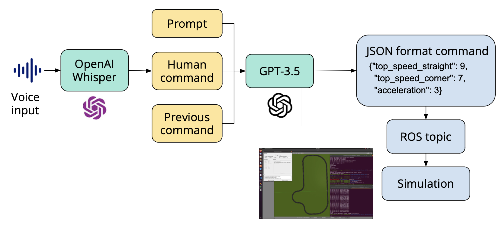

# Large Language Model Human Voice Interface (LLM HVI)

This script enables a human-voice interaction system using Whisper for voice transcription and OpenAI's GPT models for generating conversational responses. It integrates with ROS (Robot Operating System) for messaging and uses SoundDevice for audio recording.

Files in src show an example of this interface of modifying the parameters of the vehicle following waypoints. LLM will take in prompts, an example of the output, current condition of the vehicle, human's command in natural language and output modified parameters based on human's command in the form of JSON.

The output of the LLM will be published to a rostopic to control the vehicle.



## Features

- **Voice Recording**: Records voice using the microphone.
- **Voice Transcription**: Transcribes the recorded voice using OpenAI's Whisper model.
- **Text Interaction**: Generates responses based on the transcribed text using OpenAI's GPT-3.5 Turbo.
- **ROS Integration**: Publishes the generated responses to a ROS topic.

## Requirements

- Python 3.8+
- ROS Noetic
- OpenAI API key
- Whisper
- SoundDevice
- SoundFile
- ROSPy

## Installation

Ensure you have Python installed, then set up a Python environment:

```bash
python -m venv env
source env/bin/activate
```

Install the necessary Python packages:

```bash
pip install openai whisper sounddevice soundfile rospy
```

## Setup

OpenAI API Key: Insert your OpenAI API key in the script where api_key="" is located.
ROS Environment: Ensure that your ROS environment is correctly set up and that the ROS master is running.
Audio Device: Verify that your audio input device is properly configured for recording.
Usage

To run the script, navigate to the script's directory and execute:

```bash
python hvi.py
```

Make sure you are running this command in a terminal where the ROS environment is sourced, and the ROS master is active.

## Simulation

This script runs on the simulation from ECE484 by default. Please refer to [ECE484](https://publish.illinois.edu/safe-autonomy/assignments-spring-2024/) for details.


## Notes

The script continuously records and processes audio, transcribes it, and interacts based on the transcription.
Responses are published to the ROS topic /LLM_HVI.
To stop the script, use a KeyboardInterrupt (Ctrl+C in most terminals).
Troubleshooting

Microphone Access: Ensure your system has access to the microphone and that it's not being used by another application.
ROS Issues: Check the ROS network configuration if messages are not being published or received.
Contributing

Feel free to fork the project and submit pull requests or create issues for bugs and feature requests.


